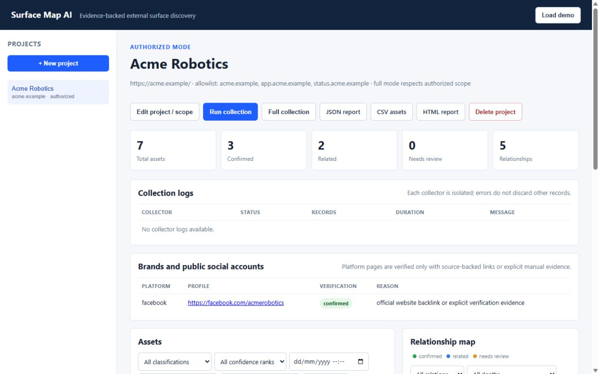
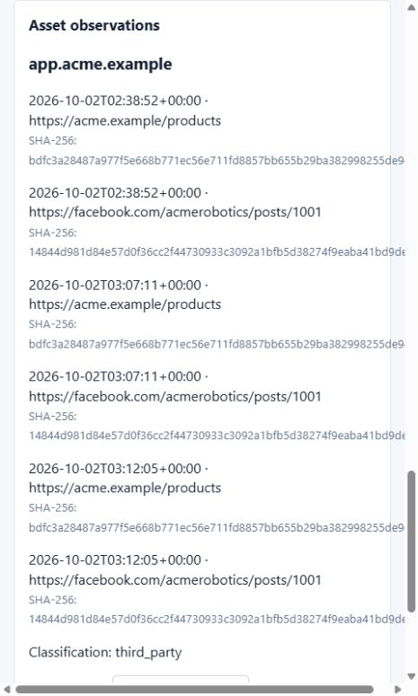

# Kiểm tra giao diện — 02/10/2026

Các thao tác và ảnh dưới đây thuộc giao diện cũ trước khi tách server và sửa theo BankDash/setup một domain. Bản mới đã qua 101 test BE, 63 curl checks API, 17 curl checks setup, 55 curl checks FE/CORS/schema và kiểm tra logic Node với DOM stub; xem [FIGMA.md](FIGMA.md) và [DOMAIN_SETUP.md](DOMAIN_SETUP.md). Browser vẫn bị saved user permission setting chặn localhost:2222 ở lượt trước, kể cả sau khi người dùng xác nhận bật quyền. Chưa kiểm tra layout/tương tác trong trình duyệt của bản mới; không coi ảnh cũ là bằng chứng bản mới.

Kiểm tra bằng trình duyệt in-app trên server localhost với SQLite riêng `runtime/browser-check.db`, provider `rules-demo` và dữ liệu Acme tổng hợp. Không dùng model trả phí hoặc thu thập tổ chức thật trong lượt kiểm tra này.

Các luồng đã thao tác và xác nhận:

- Nạp demo, xem danh sách project và các thống kê.
- Tìm kiếm, lọc loại tài sản, mở chi tiết observation sau lọc; xem source/hash và lịch sử phân loại.
- Lưu phân loại `third_party`, sau đó lọc theo phân loại mới và xác nhận tài sản xuất hiện ngay.
- Mở claim từ cạnh graph, xem quote/source, duyệt `needs_review` và kiểm tra lịch sử.
- Gắn chứng cứ `supports`, xác nhận chứng cứ xuất hiện; lọc graph theo status/depth.
- Chỉnh sửa project/aliases và lưu; Cancel đóng form mà không tạo project.
- Kiểm tra desktop 1280×800: document clientWidth/scrollWidth đều 1265px. Mobile 480×800: đều 465px; không tràn ngang.
- Không có console error trong các thao tác kiểm tra cuối.

Những lỗi tìm được đã sửa: thiếu thẻ đóng select nguồn chứng cứ làm sai role, mất click handler sau lọc, bộ lọc dùng cache phân loại cũ sau PATCH, form edit dùng nhãn tạo mới, chiều rộng nội dung làm tràn trang desktop/mobile. JavaScript bản cuối dùng cache buster `v=9`, CSS bổ sung `v=3`.

Ảnh bằng chứng:

Đã khôi phục viewport và đóng tab kiểm thử sau khi lưu ảnh. Đây là kiểm tra thủ công các luồng chính, chưa phải một bộ E2E bao phủ mọi tổ hợp trình duyệt/thiết bị.
