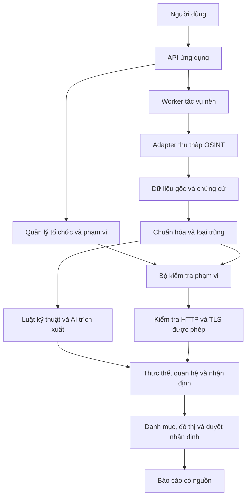

# Kế hoạch đồ án: AI hỗ trợ nhận diện bề mặt tấn công bên ngoài từ OSINT

## 1. Thông tin và định hướng

- **Tên đề tài:** Nghiên cứu và phát triển hệ thống AI hỗ trợ nhận diện bề mặt tấn công bên ngoài của tổ chức từ thông tin công khai trên Internet.
- **Nhóm thực hiện:** 2 thành viên, ký hiệu A và B; thay bằng tên thực tế khi phân công.
- **Thời gian tham khảo:** 8 tuần. Đây là giả định lập kế hoạch, chưa phải thời hạn đã được xác nhận.
- **Sản phẩm:** Ứng dụng web, bộ dữ liệu có nhãn, mã nguồn, báo cáo thực nghiệm và kịch bản demo.
- **Trọng tâm:** Liên kết tổ chức, sản phẩm, dự án và tài sản số bằng chứng cứ có thể kiểm tra; đo giá trị bổ sung của AI so với cách làm chỉ dùng luật.

Hệ thống nhận tên tổ chức, website chính thức và phạm vi được phép kiểm tra; thu thập dữ liệu công khai; chuẩn hóa, loại trùng; tạo danh mục thực thể và quan hệ; trình bày nguồn chứng cứ, mức tin cậy và báo cáo tổng hợp.

Hai câu hỏi nghiên cứu chính:

1. Kết hợp AI với luật kỹ thuật có cải thiện độ chính xác và độ bao phủ của việc trích xuất, xác định tài sản và liên kết thông tin so với chỉ dùng luật không?
2. Cách tổ chức và trình bày chứng cứ có giúp người dùng kiểm tra nhận định nhanh hơn, đồng thời giảm các kết luận thiếu căn cứ không?

## 2. Phạm vi và mức ưu tiên

### 2.1. Bản tối thiểu phải hoàn thành (MVP)

- Quản lý tổ chức, tên gọi khác, website chính thức, dữ liệu đầu vào đã biết và phạm vi kiểm tra.
- Thu thập thông tin kỹ thuật từ nguồn công khai và thông tin phi kỹ thuật từ các trang chính thức đã chọn.
- Chuẩn hóa domain, hostname, IP, URL; loại trùng và giữ nguồn của từng quan sát.
- Kiểm tra HTTP/HTTPS và TLS đối với tài sản thuộc phạm vi được phép.
- Dùng AI trích xuất tổ chức, sản phẩm, dự án, tài sản số và quan hệ có chứng cứ.
- Phân loại tài sản: thuộc/quản lý bởi tổ chức, phụ thuộc bên thứ ba, ứng viên liên quan, chưa đủ chứng cứ hoặc đã bác bỏ.
- Hiển thị danh mục, trang chi tiết chứng cứ, đồ thị quan hệ và kết quả kiểm tra chủ động.
- Cho phép xác nhận, bác bỏ hoặc chuyển nhận định sang trạng thái cần xem xét.
- Xuất danh mục CSV/JSON và báo cáo HTML hoặc Markdown có dẫn nguồn.
- So sánh phiên bản chỉ dùng luật với phiên bản dùng luật kết hợp AI trên bộ đánh giá cố định.

### 2.2. Có thể bổ sung sau khi MVP hoàn thành

- So sánh tài sản giữa hai lần thu thập; thông báo tài sản mới hoặc trạng thái thay đổi.
- Tìm kiếm ngữ nghĩa trên chứng cứ, xuất PDF, thống kê chi phí AI.
- Bổ sung nguồn OSINT khác khi điều kiện truy cập và thời gian cho phép.

### 2.3. Giới hạn của đồ án

Tập trung vào domain, hostname, IP liên quan, website, chứng chỉ TLS, tổ chức, sản phẩm, dự án và kênh chính thức. Thu thập thông tin sản phẩm và hạ tầng là trọng tâm; hồ sơ cá nhân không nằm trong bộ dữ liệu dự kiến. Kiểm tra chủ động giới hạn ở xác minh dịch vụ HTTP/HTTPS và TLS đã được cho phép. Khai thác lỗ hổng, thử mật khẩu, quét diện rộng và huấn luyện mô hình nền tảng không thuộc kế hoạch MVP.

## 3. Đối chiếu yêu cầu với đầu ra

| Yêu cầu đề tài | Công việc thực hiện | Đầu ra kiểm chứng |
|---|---|---|
| Nghiên cứu thu thập OSINT | Khảo sát nguồn, loại dữ liệu, độ mới, điều kiện truy cập và giới hạn | Bảng khảo sát nguồn; adapter thu thập |
| Chuẩn hóa và xác định tài sản | Xây khóa định danh, luật gộp, luật phân loại và xử lý mâu thuẫn | Dữ liệu chuẩn hóa; danh mục có trạng thái |
| Liên kết kỹ thuật với phi kỹ thuật | Định nghĩa thực thể và quan hệ; kết hợp luật với trích xuất AI | Các bộ ba quan hệ có chứng cứ |
| AI tổng hợp và giải thích | Trích xuất JSON có schema; truy xuất chứng cứ để tạo nhận định | Kết quả AI và báo cáo dẫn nguồn |
| Đánh giá độ chính xác, tin cậy, truy xuất nguồn | Gán nhãn thủ công, thực nghiệm đối chứng và phân tích lỗi | Bộ chuẩn, mã đánh giá và bảng kết quả |
| Kiểm tra chủ động trong phạm vi | Quản lý phạm vi độc lập; xác minh HTTP/HTTPS và TLS | Kết quả probe; nhật ký quyết định phạm vi |
| Giao diện tài sản, quan hệ, báo cáo | Xây danh mục, chi tiết chứng cứ, đồ thị và xuất báo cáo | Ứng dụng có thể demo đầy đủ |

## 4. Kiến trúc đề xuất



| Thành phần | Lựa chọn ban đầu | Lý do |
|---|---|---|
| Backend | Python, FastAPI, Pydantic | Thuận tiện xử lý dữ liệu và kiểm tra schema |
| Cơ sở dữ liệu MVP | SQLite; PostgreSQL khi mở rộng | Bản hiện tại đã chạy/kiểm thử với SQLite, lưu thực thể, quan hệ, chứng cứ và metadata JSON; chưa có adapter PostgreSQL |
| Tác vụ nền | Một worker đọc bảng job; có thể dùng thư viện queue quen thuộc | Đủ cho quy mô thử nghiệm; không chặn request giao diện |
| Thu thập kỹ thuật | Subfinder và adapter Certificate Transparency/RDAP | Tận dụng công cụ và dữ liệu có sẵn |
| Kiểm tra dịch vụ | httpx của ProjectDiscovery; thư viện TLS phù hợp | Xác minh dịch vụ và bổ sung thông tin kỹ thuật |
| Thu thập nội dung | HTTP client và bộ trích xuất văn bản HTML | Thu thập có giới hạn từ nguồn đã chọn |
| AI | LLM có sẵn qua API hoặc chạy cục bộ | Chọn theo tài nguyên máy và ngân sách thực tế |
| Frontend MVP | JavaScript, HTML/CSS và SVG trong `app/FE/` | Danh mục, bộ lọc, trang chi tiết và đồ thị đã kiểm thử; React/TypeScript/Cytoscape là hướng mở rộng chưa triển khai |
| Đóng gói | Docker Compose nếu nhóm đã quen Docker | Dễ tái hiện môi trường và demo |

Đồ thị có thể lưu bằng các bảng node/edge trong PostgreSQL. Truy xuất chứng cứ ban đầu dùng ID và tìm kiếm văn bản; cơ sở dữ liệu đồ thị hoặc vector chỉ bổ sung khi có nhu cầu đo được. Ghi cố định phiên bản công cụ, model và dependency trong cấu hình chạy.

## 5. Nguồn dữ liệu và phương pháp thu thập

### 5.1. Dữ liệu kỹ thuật

| Nguồn | Dữ liệu lấy được | Lưu ý phân tích |
|---|---|---|
| Certificate Transparency | Hostname xuất hiện trong chứng chỉ; thời gian và thuộc tính chứng chỉ | Có thể là dữ liệu lịch sử; chưa chứng minh hostname đang hoạt động |
| Subfinder và nguồn thụ động được cấu hình | Domain/subdomain ứng viên và nguồn phát hiện | Một số nguồn cần API key; ghi nhận nguồn nào thực sự chạy thành công |
| RDAP | Thông tin đăng ký domain/IP, trạng thái và tổ chức liên quan nếu công khai | Thông tin người đăng ký có thể bị ẩn hoặc không đầy đủ |
| Dữ liệu DNS | A, AAAA, CNAME, MX, NS và thời gian quan sát | Quan hệ kỹ thuật không tự chứng minh sở hữu; xử lý wildcard DNS |
| HTTP/HTTPS và TLS trong phạm vi | Trạng thái, tiêu đề, chuyển hướng, chứng chỉ, thông tin dịch vụ | Dữ liệu cần gắn thời gian; HTTP 403 hoặc lỗi TLS không đồng nghĩa không có tài sản |

Dữ liệu lấy từ bên thứ ba được đánh dấu là thu thập thụ động. Truy vấn DNS trực tiếp, truy cập website để lấy nội dung và kiểm tra dịch vụ được ghi nhận riêng là tương tác mạng; tất cả tác vụ phải tuân theo cấu hình thu thập/phạm vi tương ứng.

### 5.2. Dữ liệu phi kỹ thuật

- Trang giới thiệu, trang sản phẩm, trang dự án và tài liệu công khai của tổ chức.
- Trang tin chính thức có thông tin liên quan đến sản phẩm hoặc domain.
- URL tài khoản truyền thông hoặc kho mã nguồn được website chính thức liên kết.
- Tập trang đã lưu để dùng khi nguồn trực tiếp không truy cập được hoặc khi chạy thực nghiệm.

Giới hạn thu thập ban đầu theo danh sách website, số trang, độ sâu và thời gian. Có thể chọn mức tham khảo 50 trang/tổ chức, độ sâu 2; điều chỉnh sau lần chạy đầu. Ưu tiên lấy URL và thông tin xác nhận kênh chính thức; chưa cần thu thập toàn bộ bài đăng mạng xã hội. Ghi lỗi truy cập, giới hạn nguồn và dữ liệu thiếu vào kết quả chạy.

## 6. Mô hình dữ liệu, chuẩn hóa và nguồn chứng cứ

### 6.1. Các nhóm dữ liệu chính

| Nhóm | Trường hoặc nội dung chính |
|---|---|
| Organization | Tên chính thức, tên gọi khác, website và seed đã xác nhận |
| Entity | Loại, giá trị chuẩn hóa, tên hiển thị, thuộc tính và trạng thái |
| Observation | Giá trị quan sát, nguồn, thời gian, run ID và chứng cứ gốc |
| Relation/Claim | Chủ thể, loại quan hệ, đối tượng, phương pháp suy ra và trạng thái |
| Evidence | URL/bản ghi kỹ thuật, snapshot, đoạn trích/vị trí, thời gian và hash |
| ClaimEvidence | Liên kết nhận định với chứng cứ ủng hộ hoặc phản bác |
| AuthorizedScope | Hostname/domain/IP/CIDR được cho phép, loại kiểm tra, giới hạn và thời hạn |
| CollectionRun | Cấu hình nguồn, phiên bản công cụ, trạng thái, lỗi và thống kê |
| Review | Quyết định, người duyệt, lý do và thời gian |
| ModelRun | Model/version, prompt version, schema version, tham số và chi phí nếu có |

Tách trạng thái phân loại tài sản khỏi trạng thái duyệt nhận định. Ví dụ, một IP có thể được xác nhận là phụ thuộc bên thứ ba nhưng vẫn không thuộc phạm vi kiểm tra chủ động.

### 6.2. Quy tắc chuẩn hóa và loại trùng

- Domain/hostname: chuẩn hóa chữ thường, IDNA và dấu chấm cuối; dùng thư viện Public Suffix List khi xác định domain đăng ký. Giữ riêng mẫu wildcard và hostname cụ thể.
- IP: dùng parser chuẩn để chuẩn hóa IPv4/IPv6; lưu quan hệ hostname-IP theo từng thời điểm.
- URL: chuẩn hóa scheme và hostname, xử lý cổng mặc định; giữ nguyên ý nghĩa path và query. Không chuyển toàn bộ URL sang chữ thường hoặc xóa query tùy tiện.
- Tổ chức/sản phẩm: lưu tên gọi khác riêng; dùng ngữ cảnh và chứng cứ để gộp. Trùng tên chưa đủ để kết luận cùng thực thể.
- Khóa loại trùng thực thể: `(entity_type, normalized_value)` cho loại có định danh rõ. Quan hệ có khóa chủ thể-loại quan hệ-đối tượng, nhưng giữ từng quan sát và lịch sử chứng cứ.
- Nội dung trùng dùng hash để phát hiện; nhiều adapter sao chép cùng một nguồn không được tính là nhiều chứng cứ độc lập.
- Mâu thuẫn về sở hữu, DNS hoặc nội dung phải được giữ lại và đánh dấu; không ghi đè nhận định cũ mất dấu vết.

### 6.3. Yêu cầu truy xuất nguồn

Mỗi nhận định hiển thị phải nối được tới chứng cứ cụ thể: dữ liệu gốc, thời gian, URL hoặc nguồn kỹ thuật, đoạn trích/vị trí, phương pháp xử lý và các bước suy luận liên quan. Hash hỗ trợ kiểm tra snapshot bị thay đổi, không chứng minh nội dung nguồn là đúng. Có thể tham khảo mô hình nguồn gốc dữ liệu PROV của W3C mà không cần triển khai toàn bộ ontology.

## 7. Xác định tài sản và tích hợp AI

### 7.1. Các quan hệ cần hỗ trợ

| Quan hệ | Ý nghĩa |
|---|---|
| develops | Tổ chức phát triển sản phẩm/dự án |
| official_website_of | Website được xác nhận là website chính thức của thực thể |
| uses_domain | Sản phẩm/dự án sử dụng domain |
| subdomain_of | Quan hệ tên miền con |
| resolves_to | Hostname phân giải tới IP tại thời điểm quan sát |
| aliases_to | Quan hệ CNAME |
| certificate_contains | Chứng chỉ chứa hostname |
| official_channel_of | Kênh công khai chính thức của tổ chức/sản phẩm |
| depends_on | Tài sản phụ thuộc hạ tầng hoặc dịch vụ bên thứ ba |
| controlled_by | Tài sản được tổ chức quản lý theo chứng cứ đã kiểm tra |

`resolves_to`, `aliases_to` và `certificate_contains` là các quan hệ kỹ thuật; chúng không tự chuyển thành `controlled_by`. Dùng chung CDN, IP hoặc tên sản phẩm chỉ tạo ứng viên để xem xét. Giới hạn mở rộng quan hệ theo số bước và số ứng viên để tránh lan sang hạ tầng không liên quan.

### 7.2. Luồng AI

1. Trích xuất văn bản từ snapshot và chia thành đoạn có ID, giữ vị trí trong tài liệu gốc.
2. Cấp cho LLM schema và các đoạn cần phân tích; yêu cầu trả thực thể, quan hệ, evidence ID và đoạn trích.
3. Kiểm tra JSON bằng Pydantic; kiểm tra loại quan hệ, ID, thực thể và đoạn trích có tồn tại trong dữ liệu đầu vào.
4. Kết hợp ứng viên AI với luật kỹ thuật; lưu phương pháp tạo nhận định và chứng cứ ủng hộ/phản bác.
5. Tính mức tin cậy theo chính sách; chuyển trường hợp mâu thuẫn hoặc thiếu chứng cứ sang cần xem xét.
6. Khi tạo báo cáo, lấy các nhận định và chứng cứ phù hợp rồi sinh nội dung có dẫn nguồn. Phân biệt rõ phần đã xác nhận với phần ứng viên.

Ví dụ giả lập: trang chính thức nói Công ty A phát triển Sản phẩm B và cung cấp liên kết tới `https://product.example`. AI gợi ý quan hệ tổ chức-sản phẩm và sản phẩm-domain, kèm đoạn trích. Việc suy ra IP hạ tầng từ domain là bước kỹ thuật riêng và chưa xác nhận công ty sở hữu IP.

Nội dung trang web được xử lý như dữ liệu không đáng tin cậy đối với việc điều khiển chương trình. LLM không được tự chạy lệnh, thêm phạm vi hoặc quyết định kiểm tra mạng. Schema hợp lệ và đoạn trích tồn tại chưa chứng minh nhận định đúng; vẫn cần kiểm tra mức hỗ trợ và đánh giá thủ công.

### 7.3. Mức tin cậy ban đầu

- **Cao:** Chứng cứ trực tiếp, rõ ngữ cảnh và đủ mới cho loại nhận định; không có mâu thuẫn chưa giải quyết.
- **Trung bình:** Có liên hệ phù hợp nhưng còn khả năng giải thích khác hoặc dữ liệu chưa đầy đủ.
- **Thấp:** Chủ yếu dựa vào tương đồng tên, ngữ nghĩa, hạ tầng dùng chung hoặc nguồn lịch sử.
- **Chưa đủ chứng cứ:** Không đưa ra kết luận; vẫn lưu ứng viên và lý do thiếu dữ liệu.

Mức tin cậy áp dụng cho từng nhận định, không dùng một điểm chung cho mọi quan hệ của tài sản. Lưu các yếu tố đánh giá: độ mạnh nguồn, tính độc lập, độ mới, tính nhất quán và mâu thuẫn. Xác nhận thủ công là trạng thái riêng. Chọn chính sách/ngưỡng trên tập phát triển, khóa trước khi đánh giá. Nếu dùng điểm heuristic, mô tả đó là điểm xếp hạng; chỉ trình bày như xác suất sau khi đã hiệu chỉnh và kiểm chứng trên dữ liệu độc lập.

## 8. Kiểm tra chủ động và giao diện

### 8.1. Kiểm tra chủ động

- Lưu phạm vi được phép độc lập với tài sản ứng viên; AI không được mở rộng phạm vi.
- Kiểm tra hostname/domain theo ranh giới nhãn DNS, tránh nhầm domain có tên gần giống; xác định rõ có cho phép subdomain hay chỉ hostname cụ thể.
- Kiểm tra phạm vi trước mỗi truy cập và trước mỗi bước chuyển hướng. Xử lý đích nội bộ/đặc biệt theo cấu hình; lab riêng chỉ được dùng khi khai báo rõ.
- Cho phép kiểm tra HTTP/HTTPS và TLS với giới hạn request, concurrency, timeout, retry và tổng số tài sản.
- Không mở rộng kiểm tra toàn bộ IP dùng chung hoặc dải mạng chỉ vì tìm thấy một hostname liên quan.
- Lưu kết quả, thời gian và lý do tác vụ được thực hiện hoặc bị chặn. Báo cáo rõ các tài sản chưa được kiểm tra.

### 8.2. Các màn hình MVP

1. **Tổ chức và phạm vi:** nhập thông tin, seed, nguồn thu thập, giới hạn và phạm vi kiểm tra.
2. **Tác vụ:** tạo lần thu thập, xem tiến độ, nguồn thành công/thất bại và chạy lại có kiểm soát.
3. **Danh mục tài sản:** lọc theo loại, trạng thái, mức tin cậy, nguồn và lần quan sát gần nhất.
4. **Chi tiết:** xem quan hệ, chứng cứ ủng hộ/phản bác, kết quả dịch vụ và lịch sử duyệt.
5. **Đồ thị:** phân biệt loại node/edge; chọn quan hệ để xem chứng cứ; lọc độ sâu và trạng thái.
6. **Báo cáo:** tổng hợp tài sản, phụ thuộc, ứng viên cần xem xét, nguồn dữ liệu, giới hạn và ưu tiên xác minh.

Báo cáo phản ánh thông tin đã quan sát. Những gợi ý cần kiểm tra thêm phải được ghi rõ; chưa kết luận có lỗ hổng chỉ từ tên công nghệ hoặc phiên bản suy đoán.

## 9. Bộ dữ liệu và thiết kế thực nghiệm

### 9.1. Bộ thử nghiệm

- Một lab hoặc hệ thống nhóm được cho phép để biết danh mục tài sản chuẩn và thử chức năng chủ động.
- Hai tập hồ sơ tổ chức từ nội dung công khai đã lưu, hoặc từ dữ liệu được cho phép cung cấp; dùng để kiểm tra liên kết thông tin và tính khái quát.
- Quy mô khởi đầu tham khảo: 30-60 tài liệu, 150-300 thực thể ứng viên và 100-200 quan hệ cần gán nhãn. Điều chỉnh theo thời gian và dữ liệu thực tế.
- Có trường hợp âm và khó: tên trùng, domain không liên quan, dùng chung IP/CDN, thuê dịch vụ ngoài, chứng chỉ cũ, nguồn trùng và thông tin mâu thuẫn.
- Lưu snapshot, manifest, nguồn, thời gian và phiên bản nhãn để chạy lại thí nghiệm.

### 9.2. Gán nhãn và chia dữ liệu

1. Viết hướng dẫn nhãn cho thực thể, quan hệ, trạng thái tài sản và mức hỗ trợ của chứng cứ.
2. Hai thành viên gán nhãn độc lập trước khi xem dự đoán của hệ thống; thảo luận các bất đồng và lưu lý do thống nhất.
3. Với tài sản hoặc quan hệ không xác minh được, dùng nhãn chưa xác định; báo cáo riêng thay vì coi là sai hoặc đúng tùy ý.
4. Chia tập phát triển và tập đánh giá, tham khảo 60/40; chia theo tài liệu/thực thể hoặc tổ chức phù hợp để tránh rò rỉ nguồn trùng và tên gọi khác giữa hai tập.
5. Chỉ chỉnh luật, prompt và ngưỡng trên tập phát triển; khóa cấu hình trước khi chạy tập đánh giá.

Nếu bộ chuẩn thực tế chưa đầy đủ, Recall chỉ phản ánh danh mục chuẩn đã xác minh, không chứng minh tìm được toàn bộ tài sản trên Internet. Báo cáo kết quả lab có danh mục chuẩn và dữ liệu công khai riêng.

### 9.3. Thí nghiệm đối chứng

| Phiên bản | Cách xử lý | Mục đích |
|---|---|---|
| B0 | Luật kỹ thuật và trích xuất theo mẫu | Baseline không dùng LLM |
| B1 | Cùng đầu vào B0, bổ sung AI trích xuất và đề xuất quan hệ có chứng cứ | Đo đóng góp của AI |
| B2, tùy chọn | B1 và kiểm tra mâu thuẫn/độ mới/tính độc lập của nguồn | Đo đóng góp của chính sách chứng cứ |

Dùng cùng seed, snapshot, nguồn có sẵn và điều kiện kiểm tra để so sánh B0/B1. Lưu model, prompt, cấu hình và đầu ra từng lần chạy. Nếu đầu ra model biến động đáng kể, lặp một tập con để đo sự ổn định; không lấy kết quả tốt nhất một cách chọn lọc.

### 9.4. Chỉ số đánh giá

| Nhóm | Chỉ số | Cách đo |
|---|---|---|
| Trích xuất | Precision, Recall, F1 theo loại thực thể | Đối chiếu loại và giá trị chuẩn hóa theo quy tắc nhãn đã chốt |
| Phát hiện tài sản | Precision, Recall, F1 | Đối chiếu tài sản được nhận định thuộc/quản lý bởi tổ chức với bộ chuẩn |
| Liên kết | Precision, Recall, F1 của bộ ba | Đối chiếu chủ thể, loại quan hệ và đối tượng; báo cáo theo loại quan hệ |
| Nguồn | Tỷ lệ có chứng cứ và tỷ lệ truy xuất được | Kiểm tra claim nối tới snapshot/bản ghi gốc và vị trí cụ thể |
| Chất lượng chứng cứ | Tỷ lệ nhận định được nguồn hỗ trợ; tỷ lệ thiếu chứng cứ | Gán nhãn thủ công nguồn có hỗ trợ trực tiếp/đủ cho nhận định không |
| Tin cậy | Tỷ lệ đúng theo cao/trung bình/thấp | Đối chiếu trên tập đánh giá; báo cáo cả số lượng mỗi nhóm |
| Từ chối kết luận | Coverage và tỷ lệ chưa đủ chứng cứ | Đo số trường hợp hệ thống kết luận và số trường hợp giữ lại |
| Hiệu quả | Thời gian, số request, chi phí AI và thời gian duyệt | Ghi log; đo thời gian xử lý các mẫu tương đương |

Với từng nhiệm vụ: `Precision = TP / (TP + FP)`, `Recall = TP / (TP + FN)`, `F1 = 2PR / (P + R)`. Định nghĩa TP/FP/FN riêng cho thực thể, tài sản và quan hệ. Nêu cách xử lý mẫu số bằng 0, trường hợp chưa xác định và trường hợp hệ thống không kết luận. Khi so sánh thời gian duyệt, phân phối các mẫu tương đương hoặc đổi thứ tự để giảm ảnh hưởng việc người đánh giá đã nhớ đáp án.

### 9.5. Mục tiêu tham khảo và tiêu chí nghiệm thu

- 100% nhận định được trình bày có ID chứng cứ, nguồn và thời gian truy xuất; tiêu chí này không đồng nghĩa 100% nhận định đúng.
- Mọi kiểm tra chủ động đi qua bộ kiểm tra phạm vi; các tình huống ngoài phạm vi và chuyển hướng được kiểm chứng bằng test/lab.
- Precision xác định tài sản ở nhóm tin cậy cao hướng tới ít nhất 90%; đây là mục tiêu đề xuất, chưa phải kết quả hoặc cam kết.
- Chạy và báo cáo B0/B1 đầy đủ, kể cả khi AI không cải thiện một chỉ số; giải thích đánh đổi Precision/Recall, Coverage và chi phí.
- Tái hiện được thí nghiệm từ snapshot, cấu hình và script đánh giá; demo vẫn chạy được khi nguồn Internet bị gián đoạn.
- Có phân tích tối thiểu các nhóm lỗi: gộp sai thực thể, nhầm hạ tầng bên thứ ba, dữ liệu lịch sử, quan hệ AI suy diễn quá mức và nguồn thiếu/mâu thuẫn.

## 10. Phân công và lộ trình 8 tuần

### 10.1. Trách nhiệm

| Thành viên | Phụ trách chính | Phối hợp |
|---|---|---|
| A | Backend, schema, adapter kỹ thuật, chuẩn hóa, worker, phạm vi và kiểm tra chủ động | Thiết kế chứng cứ, tích hợp API và đánh giá |
| B | Thu thập nội dung tổ chức, AI, giao diện danh mục/đồ thị, báo cáo | Schema, gán nhãn, tích hợp và đánh giá |
| Cả hai | Chốt phạm vi, gán nhãn độc lập, review kết quả, thực nghiệm và báo cáo cuối kỳ | Review phần việc của nhau và chuẩn bị demo |

### 10.2. Mốc triển khai

| Tuần | Thành viên A | Thành viên B | Điều kiện hoàn thành |
|---|---|---|---|
| 1 | Dựng backend, schema và phạm vi | Khảo sát AI, nguồn phi kỹ thuật; phác giao diện | Chốt yêu cầu, model dữ liệu, nguồn và hướng dẫn nhãn |
| 2 | Adapter kỹ thuật đầu tiên; lưu raw/evidence | Adapter nội dung; UI tổ chức và nhập seed | Luồng nhập tổ chức -> thu thập -> lưu -> xem chứng cứ chạy được |
| 3 | Chuẩn hóa, loại trùng, nguồn thứ hai | Trích xuất AI JSON; danh mục tài sản | Gộp dữ liệu mà giữ nguồn; đầu ra AI qua kiểm tra schema |
| 4 | Luật baseline; bộ kiểm tra phạm vi và probe | Quan hệ có chứng cứ; chi tiết và duyệt nhận định | B0 và B1 chạy trên mẫu nhỏ; kiểm tra chủ động đúng phạm vi |
| 5 | Tích hợp pipeline; log, retry và kết quả kỹ thuật | Đồ thị, bộ lọc và mức tin cậy | Demo toàn bộ luồng; quan hệ trên đồ thị truy xuất được nguồn |
| 6 | Cố định dữ liệu, script đánh giá | Xuất báo cáo; hoàn thiện bộ nhãn | Khóa tập đánh giá, prompt, luật và cấu hình; kết thúc tính năng MVP |
| 7 | Chạy thực nghiệm; thống kê và phân tích lỗi | Kiểm tra chứng cứ, thời gian duyệt; viết kết quả | Có bảng B0/B1, phân tích lỗi và các giới hạn |
| 8 | Sửa lỗi ảnh hưởng demo; đóng gói và hướng dẫn chạy | Hoàn thiện báo cáo, slide và kịch bản trình bày | Chạy lại từ môi trường sạch; demo bằng snapshot; bàn giao đầy đủ |

Cuối mỗi tuần có một bản chạy được và cập nhật checklist. Nếu tiến độ chậm, giảm số nguồn và tính năng tùy chọn; giữ chức năng chứng cứ, kiểm tra phạm vi và thí nghiệm đối chứng. Nếu chỉ còn 4-6 tuần, dùng snapshot sẵn, giữ hai nguồn kỹ thuật và một nhóm nguồn chính thức, gộp các mốc nhưng vẫn dành giai đoạn cuối cho đánh giá.

## 11. Backlog triển khai

### Giai đoạn 1: Nền tảng và dữ liệu

- [ ] Chốt tổ chức thử nghiệm, nguồn dữ liệu và phạm vi được phép.
- [x] Tạo backend, frontend, database và cấu hình môi trường.
- [x] Thống nhất schema Entity/Relation/Evidence/Scope và hợp đồng API.
- [x] Lưu raw snapshot, thời gian, hash và metadata từng lần chạy.
- [x] Tích hợp adapter kỹ thuật đầu tiên và adapter nội dung chính thức.
- [ ] Chuẩn hóa, loại trùng, giữ lịch sử và xử lý nguồn mâu thuẫn.
- [x] Tạo manifest dữ liệu và hướng dẫn gán nhãn.

### Giai đoạn 2: Phân tích và kiểm tra

- [x] Xây B0 và lưu luật tạo mỗi nhận định.
- [x] Tích hợp LLM với schema, evidence ID và kiểm tra đoạn trích.
- [ ] Xây B1, mức tin cậy và trạng thái chưa đủ chứng cứ.
- [x] Thêm bộ kiểm tra phạm vi trước request/chuyển hướng.
- [x] Tích hợp HTTP/HTTPS và TLS; ghi nhận lỗi, dữ liệu thiếu và trạng thái chưa kiểm tra.
- [x] Kiểm chứng các tình huống domain gần giống, wildcard, CDN, URL normalization và nguồn trùng.

### Giai đoạn 3: Giao diện và đánh giá

- [x] Hoàn thiện danh mục, chi tiết chứng cứ và xác nhận/bác bỏ nhận định.
- [x] Hoàn thiện đồ thị, bộ lọc và báo cáo có dẫn nguồn.
- [ ] Gán nhãn độc lập, xử lý bất đồng và chia tập phát triển/đánh giá.
- [ ] Khóa cấu hình; chạy B0/B1 và tính các chỉ số.
- [ ] Phân tích lỗi, chi phí, thời gian và sự ổn định cần thiết.
- [ ] Hoàn thiện hướng dẫn chạy, báo cáo, slide và demo với dữ liệu cố định.

## 12. Rủi ro triển khai và phương án xử lý

| Vấn đề | Ảnh hưởng | Phương án |
|---|---|---|
| Nguồn yêu cầu API key hoặc giới hạn truy cập | Thiếu dữ liệu; khó tái hiện | Adapter độc lập, ghi nguồn khả dụng và lưu snapshot cho thực nghiệm |
| Lab không có CT/RDAP công khai | Không mô phỏng đầy đủ OSINT thực tế | Kết hợp lab kiểm tra chủ động với corpus công khai đã lưu; báo cáo tách biệt |
| AI suy diễn sai quan hệ | False positive và nhận định thiếu căn cứ | Đầu ra có evidence ID; kiểm tra nguồn; giữ trạng thái cần xem xét |
| Dữ liệu cũ hoặc hạ tầng dùng chung | Nhầm tài sản đang hoạt động hoặc chủ sở hữu | Tách thời gian quan sát, quan hệ kỹ thuật, quyền quản lý và phụ thuộc |
| Bộ nhãn nhỏ hoặc chưa đầy đủ | Kết quả khó khái quát | Báo cáo số mẫu, từng nhóm lỗi, số chưa xác định và giới hạn Recall |
| Thiếu thời gian | Không đủ đánh giá hoặc demo | Khóa MVP tuần 6; cắt tính năng tùy chọn trước |
| Model/API không sẵn khi demo | Gián đoạn luồng trình bày | Lưu đầu ra các lần chạy; dùng replay minh bạch, hiển thị thời gian và model gốc |

## 13. Hồ sơ bàn giao và kịch bản demo

### 13.1. Hồ sơ

- Mã nguồn và cấu hình chạy; dependency/công cụ được ghi phiên bản.
- README hướng dẫn cài đặt, nguồn cần key, nạp dữ liệu mẫu và chạy đánh giá.
- Schema và tài liệu API; mô tả các trạng thái tài sản/nhận định.
- Dataset snapshot, manifest, hướng dẫn nhãn và ground truth.
- Script đánh giá, bảng kết quả B0/B1, phân tích lỗi và giới hạn.
- Báo cáo cuối kỳ, slide, báo cáo mẫu có dẫn nguồn và kịch bản demo.

### 13.2. Cấu trúc báo cáo đề xuất

1. Bài toán, mục tiêu, phạm vi và câu hỏi nghiên cứu.
2. Cơ sở lý thuyết: OSINT, EASM, chuẩn hóa, phân giải thực thể, liên kết và nguồn chứng cứ.
3. Thiết kế hệ thống, mô hình dữ liệu, phạm vi kiểm tra và phương pháp kết hợp luật-AI.
4. Triển khai chức năng và giao diện.
5. Bộ dữ liệu, gán nhãn, thiết kế đối chứng và kết quả đánh giá.
6. Thảo luận: lỗi, đánh đổi, giới hạn và hướng phát triển.

### 13.3. Demo tham khảo 7-10 phút

1. Giới thiệu tổ chức mẫu, seed và phạm vi được phép.
2. Chạy/nạp một lần thu thập; hiển thị nguồn thực sự được sử dụng và thời gian dữ liệu.
3. Mở tài sản đã chuẩn hóa để cho thấy loại trùng nhưng giữ nguồn.
4. Chọn một quan hệ tổ chức-sản phẩm-domain và mở đoạn chứng cứ.
5. Xem một trường hợp dùng chung IP hoặc chứng cứ yếu; minh họa trạng thái ứng viên/phụ thuộc.
6. Chạy kiểm tra tài sản trong lab và minh họa chặn đích ngoài phạm vi bằng test có kiểm soát.
7. Xác nhận hoặc bác bỏ một nhận định; xuất báo cáo và trình bày kết quả B0/B1.

## 14. Tài liệu tham khảo ban đầu

Các tài liệu dưới đây đã được đối chiếu khi lập định hướng. Khi viết báo cáo, nhóm ghi ngày truy cập và phiên bản phù hợp; kế hoạch triển khai và mục tiêu đánh giá trong tài liệu này là đề xuất của đồ án.

- [OWASP: Attack Surface Identification](https://wstg.owasp.org/latest/4-Web_Application_Security_Testing/01-Information_Gathering/04-Attack_Surface_Identification/) - cơ sở về nhận diện ứng dụng, domain và dịch vụ bên ngoài; dùng bản được đánh phiên bản khi trích dẫn chính thức nếu có.
- [Microsoft: What is discovery?](https://learn.microsoft.com/en-us/azure/external-attack-surface-management/what-is-discovery) - seed, tài sản ứng viên, tài sản đã xác nhận và phụ thuộc bên thứ ba.
- [ProjectDiscovery: Subfinder](https://docs.projectdiscovery.io/opensource/subfinder/overview) - tìm subdomain từ nguồn thụ động và tích hợp đầu ra.
- [ProjectDiscovery: httpx](https://docs.projectdiscovery.io/opensource/httpx/overview) - kiểm tra dịch vụ HTTP; phân biệt công cụ này với thư viện Python cùng tên.
- [RFC 9083: RDAP JSON Responses](https://www.rfc-editor.org/info/rfc9083/) - cấu trúc dữ liệu đăng ký domain và tài nguyên Internet.
- [W3C: PROV-O](https://www.w3.org/TR/prov-o/) - mô hình nguồn gốc dữ liệu và quan hệ dẫn xuất.
- [Lewis et al.: Retrieval-Augmented Generation for Knowledge-Intensive NLP Tasks](https://arxiv.org/abs/2005.11401) - cơ sở về kết hợp truy xuất dữ liệu với sinh nội dung.
- [Gao et al.: Enabling Large Language Models to Generate Text with Citations](https://aclanthology.org/2023.emnlp-main.398/) - đánh giá tính đúng và chất lượng chứng cứ/trích dẫn của LLM.


## 15. Đối chiếu và bổ sung triển khai ngày 02/10/2026

### 15.1. Trạng thái nghiệm thu

Phần mềm đã có luồng MVP có thể chạy và kiểm thử tái hiện. Các tiêu chí nghiên cứu tại mục 9 và hồ sơ thực nghiệm tại mục 13 chưa hoàn thành. Không dùng kết quả fixture Acme để tuyên bố đạt Precision 90% trên tổ chức thật hay chứng minh AI cải thiện baseline.

`app/docs/PLAN_AUDIT.md` ghi bảng đối chiếu từng yêu cầu, lỗi trước sửa, phần đã bổ sung và giới hạn còn lại. Các checkbox mục 11 chỉ đánh dấu những đầu ra phần mềm có bằng chứng kiểm tra; bộ nhãn độc lập, corpus/lab thật, thực nghiệm B0/B1 và báo cáo/slide vẫn chưa được đánh dấu hoàn thành.

### 15.2. Phần mã đã bổ sung

- [x] Tách mã backend vào `app/BE/app/`, frontend vào `app/FE/`; sửa package import, Docker, script và hướng dẫn chạy.
- [x] Hàng đợi SQLite, worker một process, API 202 và run polling, collector transaction/log và phục hồi queued/interrupted.
- [x] Kiểm tra input/schema, IDNA/IPv6/wildcard/www/URL semantics, Public Suffix List; DNS A/AAAA/CNAME/MX/NS và các liên kết kỹ thuật.
- [x] Phạm vi chủ động riêng theo hostname/domain/IP/CIDR, HTTP/TLS, expiry; redirect được kiểm tra từng bước, kết nối IP pinned và TLS verify.
- [x] Lab private cần đồng thời ALLOW_PRIVATE_LAB=true và allow_private=true trên scope phù hợp; link-local/reserved/multicast/unspecified vẫn chặn. Mặc định tắt.
- [x] TLS collector, HTTP status/headers/redirect và probe_error; giữ wildcard/chứng chỉ CT lịch sử và RDAP roles đúng hơn.
- [x] Raw snapshots, SHA-256, chunks/offsets, run IDs, nhiều observation/evidence và supports/refutes.
- [x] Review history, giữ human review khi tái thu thập, classification độc lập với claim status/scope, nguồn trái chiều chuyển needs_review.
- [x] AI schema/predicate/reference/quote checks, prompt xử lý nguồn như dữ liệu, source catalog có giới hạn và loại trùng hash, ModelRun/output/input hash/usage.
- [x] Sửa luật sản phẩm gán nhầm host cùng trang; manual social assertion cần backlink snapshot hoặc human review.
- [x] UI lọc tài sản, mở observations, graph status/depth/click evidence, review/history/classification; sửa lỗi cancel và mất click sau lọc.
- [x] CSV/JSON/HTML export, dữ liệu report có provenance, CSV chống formula injection và HTML escape.
- [x] Sửa Precision bị lọc bỏ false positives; đo entity/asset/relationship, predicate buckets, coverage, traceability; B0 độc lập và B1 opt-in trên cùng snapshot.
- [x] Manifest/snapshot fixture vật lý, hướng dẫn gán nhãn, OpenAPI/API.md, requirements-lock và curl smoke runner kiểm tra mọi API đã khai báo.

### 15.3. Bằng chứng kiểm tra và cách tái hiện

Lượt kiểm tra cuối sau khi bổ sung setup một domain: **101 test tự động đạt; 63 kiểm tra curl API, 17 kiểm tra curl setup và 55 kiểm tra curl FE/CORS đạt, bao phủ 24 API**. Docker BE bản mới cũng đạt 63 curl checks và cả hai image BE/FE build thành công. Lượt trước sửa giao diện có 71 curl checks trên Windows và Docker. Tổng hợp bằng chứng và giới hạn tại `app/docs/verification/SUMMARY.md`, `FIGMA.md` và `DOMAIN_SETUP.md`.

```powershell
Set-Location .\app
.\.venv\Scripts\python.exe scripts/run_tests.py
.\.venv\Scripts\python.exe scripts/smoke_api.py
.\.venv\Scripts\python.exe scripts/check_frontend.py
.\.venv\Scripts\python.exe scripts/smoke_setup.py
.\.venv\Scripts\python.exe scripts/evaluate.py --output docs/verification/evaluation.json
node --check FE/app.js
docker compose config --quiet
docker compose up --build
```

Kết quả thực thi nằm trong `app/docs/verification/pytest.txt`, `pytest.xml`, `curl-results.json`, `evaluation.json` và báo cáo Docker/UI. Curl runner khởi động server/DB tạm, thực hiện curl thật, đối chiếu route OpenAPI rồi dừng server. Các collector DNS/CT/RDAP/TLS/provider được kiểm thử với fixture/mocks; chưa tuyên bố tất cả nguồn Internet thật đang khả dụng. Không sửa/xóa project người dùng khi kiểm thử.

### 15.4. Công việc còn thiếu để nghiệm thu nghiên cứu

- [ ] Cung cấp lab được phép kiểm tra và hai hồ sơ tổ chức thật; khóa nguồn, điều kiện sử dụng và scope/thời hạn.
- [ ] Thu thập snapshot corpus thật, ghi lỗi/missing data và hash; chia development/evaluation theo tổ chức/tài liệu/nguồn trùng.
- [ ] Hai người gán nhãn độc lập, lưu bất đồng, nhãn thống nhất và phiên bản ground truth; dùng `app/docs/LABELING_GUIDE.md`.
- [ ] Cấu hình model/provider/key và chạy B0/B1 trên cùng snapshot/seed; ghi đầy đủ kết quả kể cả không cải thiện.
- [ ] Đánh giá thủ công nguồn có hỗ trợ nhận định, độ mới/độc lập/mâu thuẫn, thời gian duyệt; đo ổn định và chi phí theo giá thật.
- [ ] Viết phân tích lỗi, báo cáo cuối kỳ, slide và demo với số liệu thực nghiệm đã đo.

Subfinder, PostgreSQL, React/Cytoscape, semantic search, PDF và so sánh hai lần thu thập nằm ở backlog mở rộng; chưa được tự ghi là đã triển khai. Tính năng phần mềm có thể bổ sung bằng code; dữ liệu thật, quyền kiểm tra và kết quả gán nhãn/thực nghiệm cần thông tin thực tế của nhóm.

### 15.5. Cấu trúc thư mục cuối theo yêu cầu

Thư mục ngoài cùng chỉ có `app/` và `plan.md` (giữ `.git/` ẩn để bảo toàn lịch sử). Trong `app/` có `BE/`, `FE/`, `data/`, `docs/`, `scripts/`, `tests/`, `.venv/` và toàn bộ file cấu hình/Docker/README/yêu cầu đồ án. Chạy cài đặt, server, test và Docker từ `app/`; xem `app/README.md`. Database và cấu hình hiện có được chuyển nguyên trạng.

### 15.6. Chạy FE và BE bằng hai cổng riêng

FE chạy port 2222, BE chạy port 3333. BE không còn phục vụ /static hoặc trang FE; frontend có server riêng, config.js định địa chỉ API và link report gọi đúng BE. CORS chỉ cho các frontend origin đã khai báo. Cả native script start_dev.py và Docker Compose đều chạy hai server. Kiểm tra tái hiện: từ app/, chạy `.\.venv\Scripts\python.exe scripts/smoke_split_ports.py`; bằng chứng tại app/docs/verification/split-curl-results.json.

### 15.7. Giao diện theo Figma BankDash

- [x] Đọc context và ảnh desktop/mobile từ Figma; triển khai header/sidebar, màu/font/thẻ và bố cục dashboard trong `app/FE/`.
- [x] Gắn thống kê, observations, charts và quick actions với dữ liệu/chức năng OSINT; giữ scope, review, graph và report.
- [x] Lưu icon/ảnh/font cục bộ, giữ kích thước root SVG và biến thể mobile; bổ sung saved source snapshot/hash.
- [x] Kiểm tra logic FE với dữ liệu demo và project rỗng, syntax, curl tài nguyên/CORS và build Docker FE.
- [ ] Nghiệm thu trực quan trên trình duyệt desktop/mobile, kiểm tra geometry từng asset và overflow. Browser vẫn báo saved user permission setting chặn localhost:2222 sau khi người dùng xác nhận bật quyền; chưa có ảnh chạy thực tế của bản BankDash.

Chi tiết tại `app/docs/verification/FIGMA.md`. Khi FE/BE đang chạy, gọi `.\.venv\Scripts\python.exe scripts/smoke_frontend.py` từ `app/` để kiểm tra curl chỉ đọc, không thay đổi project.

### 15.8. Thiết lập chỉ bằng một domain

- [x] Form setup một input domain; tự tạo project/website/allowlist và tự khởi chạy collection/AI.
- [x] Chuẩn hóa domain/IDNA; từ chối input sai; tạo project/job cùng transaction và dùng lại active job khi gửi lại.
- [x] Tự phát hiện social profiles từ website snapshot có scope, giữ backlink làm chứng cứ.
- [x] Tự cập nhật kết quả, nhớ project và tiếp tục theo dõi job sau reload; hiển thị lỗi form/collector/provider.
- [x] Test regression, curl API và flow setup với fixture, kiểm tra logic FE và cập nhật OpenAPI/hướng dẫn chạy.

Mặc định dùng passive; domain đơn lẻ không tự trở thành xác nhận quyền sở hữu hoặc mở scope chủ động. Các nguồn cần login/key/export và nhận định thiếu chứng cứ vẫn có giới hạn được ghi rõ tại `app/docs/verification/DOMAIN_SETUP.md`. Không dùng fixture thay cho corpus/thực nghiệm thật trong mục 15.4.
